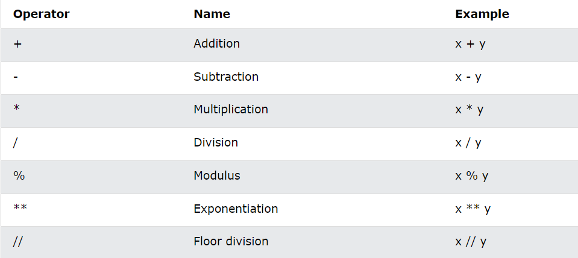
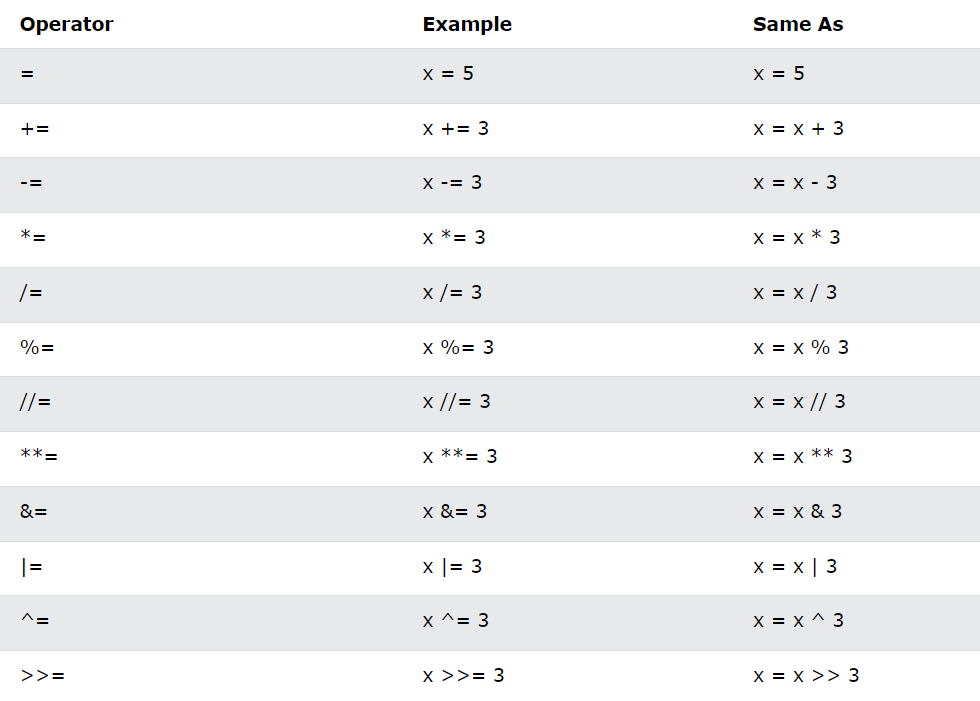
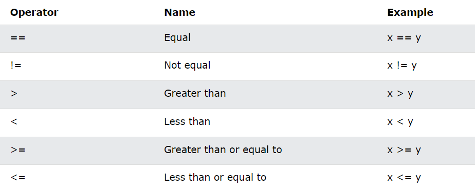
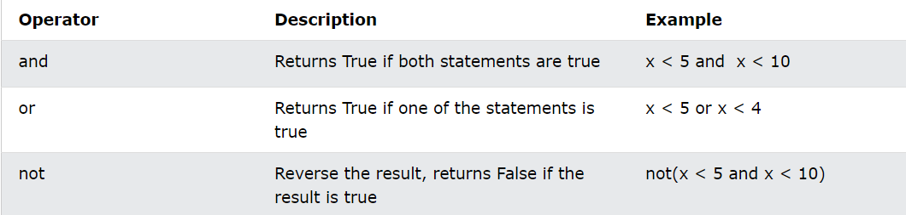

# Python DSA and OOP

Welcome to the **Python DSA and OOP** repository! This repository is a comprehensive collection of Python implementations for various Data Structures and Algorithms (DSA) as well as Object-Oriented Programming (OOP) concepts. It is designed to serve as a resource for students, developers, and anyone interested in strengthening their understanding and skills in these fundamental areas of computer science.

## Overview

In this repository, you will find:

- **Data Structures**: Implementations of common data structures such as arrays, linked lists, stacks, queues, trees, and more.
- **Object-Oriented Programming**: Examples and explanations of OOP principles such as classes, objects, inheritance, polymorphism, encapsulation, and abstraction.
- **Practical Examples**: Real-world examples and problem-solving techniques using DSA and OOP principles.

## Structure

The repository is organized into the following directories:

- `data_structures/`: Contains implementation of various data structures.
- `oop_concepts/`: Demonstrates OOP concepts with examples and explanations.
- `examples/`: Contains practical examples and problem-solving scenarios.

## Getting Started

To get started with this repository, clone it to your local machine:

```bash
git clone https://github.com/your-username/python-dsa-oop.git
cd python-dsa-oop
```

## Syntax Of Print Statement
```bash
print("Hello World")
```

Comments in Python are written with a special character, which one?
```bash
YES , "#".
FOR MULTILINE COMMENT WE USE THIS """  
                                     statements
                                  """
```

<br>

## Variable Declaration 

## Data Types

In programming, data type is an important concept.
Variables can store data of different types, and different types can do different things.
Python has the following data types built-in by default, in these categories:

```bash
Text Type:	str
Numeric Types:	int, float, complex
Sequence Types:	list, tuple, range
Mapping Type:	dict
Set Types:	set, frozenset
Boolean Type:	bool
```

### Question : The following code example would print the data type of x, what data type would that be?

```bash
x = ["apple", "banana", "cherry"]
print(type(x))
print(x)
```
### Answer : List[].
<br>
<br>

### Question: The following code example would print the data type of x, what data type would that be?

```bash
x = ("apple", "banana", "cherry")
print(type(x))
print(x)
```
### Answer: Tuple().

<br>
<br>

### Question: The following code example would print the data type of x, what data type would that be?

```bash
x = {"name" : "John", "age" : 36}
print(type(x))
print(x)
```
### Answer: Dictionary{}.

<br>
There are three numeric types in Python:

1. int
2. float
3. complex

<br>

## Numbers
Variables of numeric types are created when you assign a value to them:

```bash
x = 1    # int
y = 2.8  # float
z = 1j   # complex
```

<br>

You can convert from one type to another with the int(), float(), and complex() methods:
```bash
x = 1    # int
y = 2.8  # float
z = 1j   # complex

#convert from int to float:
a = float(x)

#convert from float to int:
b = int(y)

#convert from int to complex:
c = complex(x)

print(a)
print(b)
print(c)

print(type(a))
print(type(b))
print(type(c))
```

<br>

Import the random module, and display a random number between 1 and 9:
```bash
import random

print(random.randrange(1, 10))
```

<br>


### Question: <br>Use the len function to print the length of the string.

```bash
x = "Hello World"
print(len(x))
```

<br>

### Question: <br>Get the first character of the string txt.

```bash
txt = "Hello World"
x = txt[0]
```
<br>

### Question: <br>Get the characters from index 2 to index 4 (llo).

```bash
txt = "Hello World"
x = txt[2:5]
```

<br>

### Question : <br>Return the string without any whitespace at the beginning or the end.

```bash
txt = " Hello World "
x = txt.strip()
```

<br>

### Question : <br>Convert the value of txt to upper case & lower case.

```bash
txt = "Hello World"
txt = txt.upper()

txt = "Hello World"
txt = txt.lower()
```

<br>

### Question: <br>Replace the character H with a J.

```bash
txt = "Hello World"
txt = txt.replace("H", "J")
```

<br>

### Question: <br>Insert the correct syntax to add a placeholder for the age parameter.

```bash
age = 36
txt = "My name is John, and I am {}"
print(txt.format(age))
```

<br>

## Operators
Python divides the operators in the following groups:

Arithmetic operators
Assignment operators
Comparison operators
Logical operators
Identity operators
Membership operators
Bitwise operators

<br>

### Arithmetic Operators
Arithmetic operators are used with numeric values to perform common mathematical operations:



### Assignment Operators
Assignment operators are used to assign values to variables:



### Comparison Operators
Comparison operators are used to compare values:



### Logical Operators
Logical operators are used to combine conditional statements:



<br>

## Lists

Lists are used to store multiple items in a single variable.

Lists are one of 4 built-in data types in Python used to store collections of data, the other 3 are Tuple, Set, and Dictionary, all with different qualities and usage.

Lists are created using square brackets:

```bash
thislist = ["apple", "banana", "cherry"]
print(thislist)
```

### List Items
List items are ordered, changeable, and allow duplicate values.

List items are indexed, the first item has index [0], the second item has index [1] etc.

### Example
Lists allow duplicate values:

```bash
thislist = ["apple", "banana", "cherry", "apple", "cherry"]
print(thislist)
```

<br>

### Question:
Print the number of items in the list:

```bash
thislist = ["apple", "banana", "cherry"]
print(len(thislist))
```

### Question:
Print the number of items in the list:

```bash
thislist = ["apple", "banana", "cherry"]
print(len(thislist))
```

### Question:
String, int and boolean data types:

```bash
list1 = ["apple", "banana", "cherry"]
list2 = [1, 5, 7, 9, 3]
list3 = [True, False, False]
```

### Question:
Use the insert method to add "lemon" as the second item in the fruits list.

```bash
fruits = ["apple", "banana", "cherry"]
fruits.insert(1,"lemon")
```

### Question:
Use the remove method to remove "banana" from the fruits list.

```bash
fruits = ["apple", "banana", "cherry"]
fruits.remove("banana")
```

